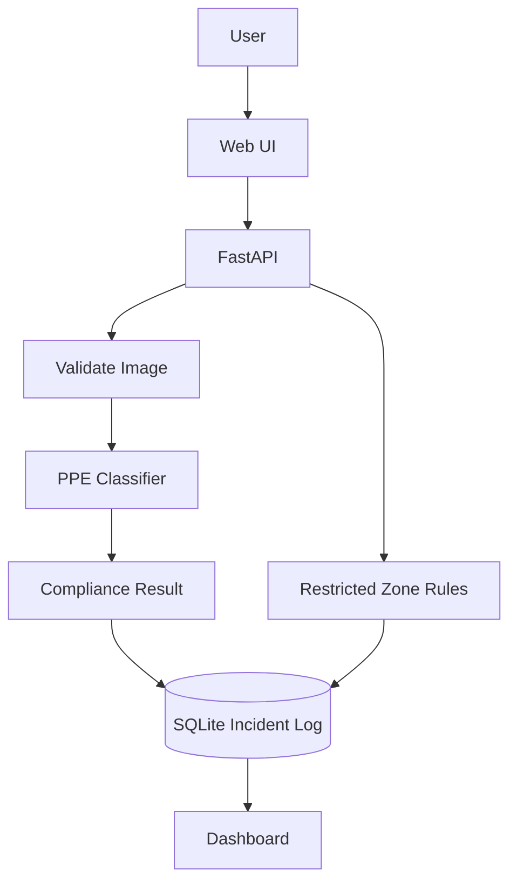

# Project Flow

```mermaid
flowchart TD
A[User] --> B[Web UI]
B --> C[FastAPI]
C --> D[Validate Image]
D --> E[PPE Classifier]
E --> F[Compliance Result]
F --> G[(SQLite Incident Log)]
C --> H[Restricted Zone Rules]
H --> G
G --> I[Dashboard]
```
