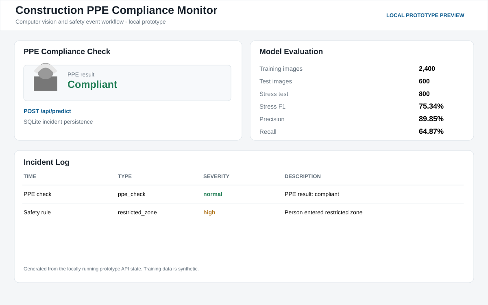

# Construction PPE Compliance Monitoring Using Computer Vision

Portfolio prototype for construction-site safety monitoring.



## What is included
- PPE compliance image classifier
- Restricted-zone safety rule engine
- FastAPI backend
- SQLite incident log
- Browser dashboard
- Reproducible training script
- PRD, TRD, project flow, UI UX design, backend schema and implementation plan

## Measured prototype result
- 3000 synthetic worker images
- 800-image stress test with occlusion and lighting variation
- Stress-test F1: 75.34 percent

## Run
```bash
pip install -r requirements.txt
python src/train_model.py
uvicorn src.main:app --reload --port 8001
```

Open http://127.0.0.1:8001

Note: the dataset is synthetic. This is a portfolio prototype, not a production CCTV system.
